# CV_basics

.gifs and visualizations take a few seconds to load...

## About
This repository contains projects completed for **CIS 5800: Machine Perception (Fall 2025)** at the **University of Pennsylvania**, taught by **Prof. Kostas Daniilidis**.  
Course website: [https://sites.google.com/seas.upenn.edu/cis5800f2025/](https://sites.google.com/seas.upenn.edu/cis5800f2025/)

The course builds a complete foundation in **geometric and learning-based Computer Vision**, moving from projective geometry to 3D reconstruction, optical flow, and radiance-field representations.

---

## HW 5 – Optical Flow & Epipole Estimation

**Goal:** Estimate pixel-level motion between frames using **Lucas–Kanade Optical Flow**, then recover the **epipole (FOE: Focus of Expansion)** assuming pure camera translation.

### Part 1 — Lucas–Kanade Optical Flow
Using spatiotemporal gradients $ (I_x, I_y, I_t) $, I implemented a patch-based Lucas–Kanade solver to compute dense flow $ (u, v) $. Each $5\times5$ neighborhood forms an overdetermined system solved with least squares, and the smallest singular value provides a **confidence measure**.

  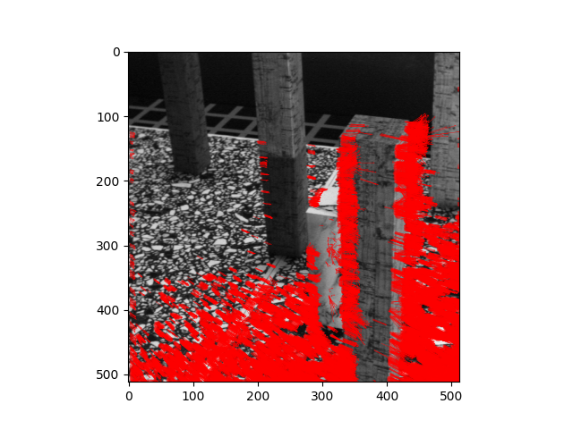

<em>Optical flow visualization. Red vectors show per-pixel motion direction and magnitude.</em>

### Part 2 — Epipole (Focus of Expansion)
Using reliable flow vectors $(s_{\min} > \text{threshold})$, I ran **RANSAC** to estimate the epipole $e$, enforcing

$$ e^\top (x_p \times u) = 0 $$

Flow rays should intersect at the epipole, which represents the camera’s motion direction.

  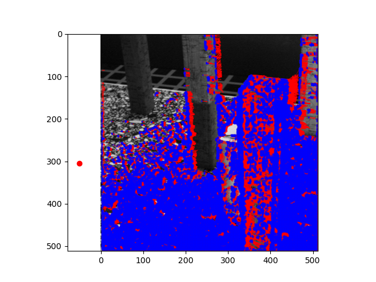

<em>Estimated epipole location with inlier flow vectors converging toward a common motion focus.</em>

**Concepts Learned:** Spatiotemporal gradients, Lucas–Kanade optical flow, confidence via SVD singular values, RANSAC geometry fitting, ego-motion interpretation from flow.

---

## HW 4 – Bundle Adjustment, COLMAP, and Transformer-Based Feature Matching

**Goal:** Reconstruct the Penn Commons scene using both classical (SIFT) and modern (LoFTR) feature pipelines, followed by **Bundle Adjustment (BA)** implemented from scratch in **PyTorch**.

### Part 1 — COLMAP Reconstruction
Using the provided multi-view dataset, I ran COLMAP’s feature extraction, matching, and sparse reconstruction pipeline. The recovered camera poses and point cloud provide a reference solution for the custom BA implementation.

  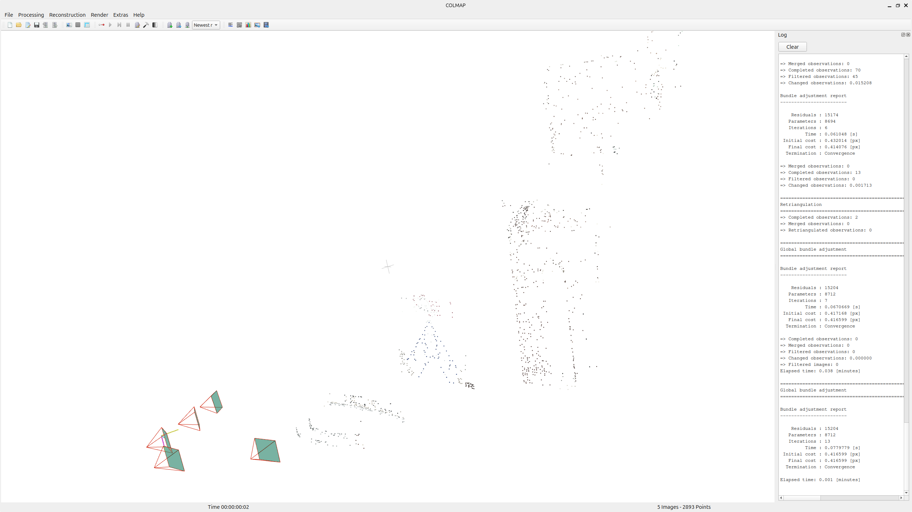

<em>Sparse reconstruction produced by COLMAP.</em>

### Part 2 — Bundle Adjustment with SIFT Features
1. Initialize camera poses (axis–angle + translation) and 3D structure.
2. Reproject all points across all frames.
3. Optimize all parameters with gradient descent in PyTorch.
4. Visualize convergence and compare with COLMAP.

The SIFT-based BA converged at **8.83e-5** around **14k iterations**.

  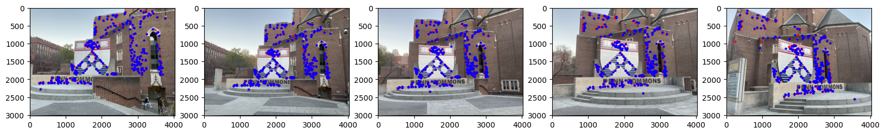

  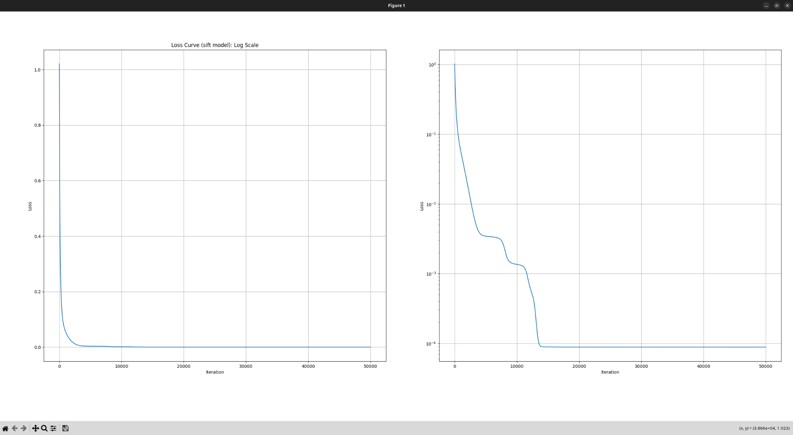
  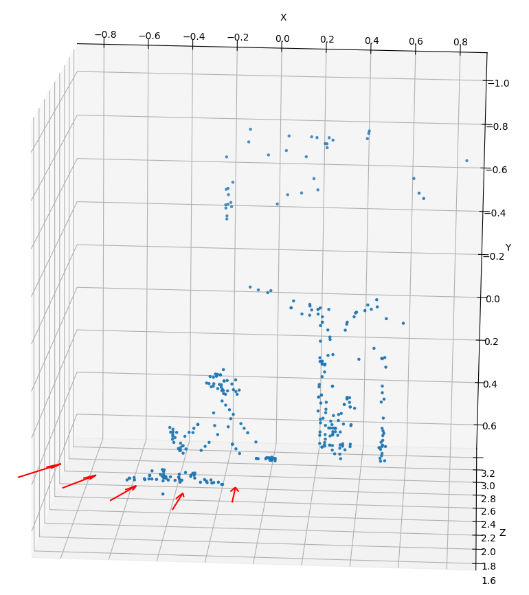

<em>LEFT: Loss curve (left: linear scale, right: log scale), RIGHT: Recovered 3D point cloud using SIFT features.</em>

### Part 3 — LoFTR: Detector-Free Transformer Feature Matching
I implemented common-feature extraction across all views using **LoFTR**, a detector-free transformer model. The extracted features were then fed into the same PyTorch BA pipeline.

- LoFTR BA reaches the SIFT loss level in **~10k iterations**  
- Final convergence at **2.6e-7**, about **3.4×10²** better than SIFT  
- LoFTR’s point cloud is more abstract and less interpretable, but numerically superior

  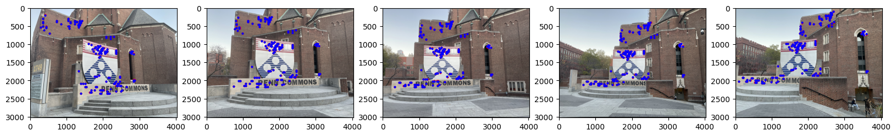

  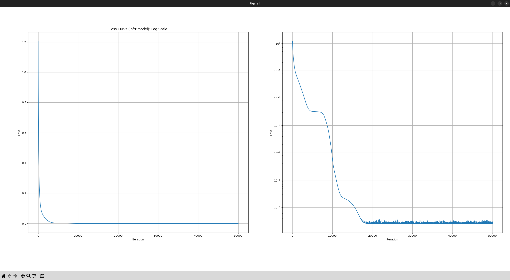
  

<em>LEFT: Loss curve (left: linear scale, right: log scale), RIGHT: Recovered 3D point cloud using LoFTR features.</em>

**Concepts Learned:**  
- Bundle Adjustment parameterization (axis–angle rotation, translation, and structure)  
- Differentiable reprojection and loss computation in **PyTorch**
- Gradient-based BA optimization and convergence visualization  
- Classical vs. Transformer-based feature matching (SIFT vs. LoFTR)  
- Practical multi-view reconstruction and comparison with COLMAP  

---

## HW 3 - 3D Reconstruction from Two Views
**Goal:** Recover the relative pose between two images and reconstruct the 3D scene using feature matching and multi-view geometry.

**Pipeline Overview:**
1. Extract **SIFT** features and compute correspondences.  
2. Estimate the **essential matrix (E)** with the 8-point algorithm and **RANSAC**.  
3. Recover all four pose candidates (R, T) from E and select the physically valid one.  
4. **Triangulate** 3D points and reconstruct the scene structure.  
5. Visualize epipolar geometry, reprojection accuracy, and the resulting 3D model.

**Concepts Learned:**  
Feature matching, essential matrix estimation, epipolar geometry, camera pose disambiguation, triangulation.

  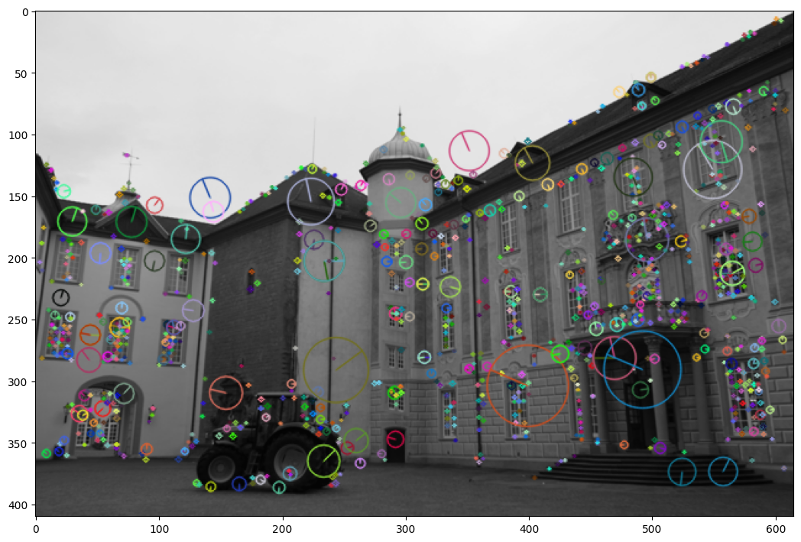
  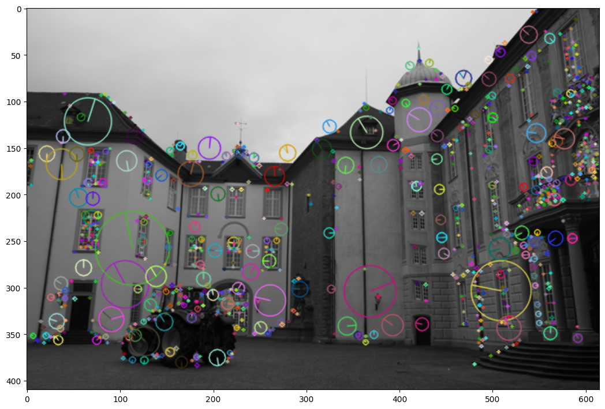

<em>Keypoints extracted and matched between two views using SIFT descriptors.</em>

  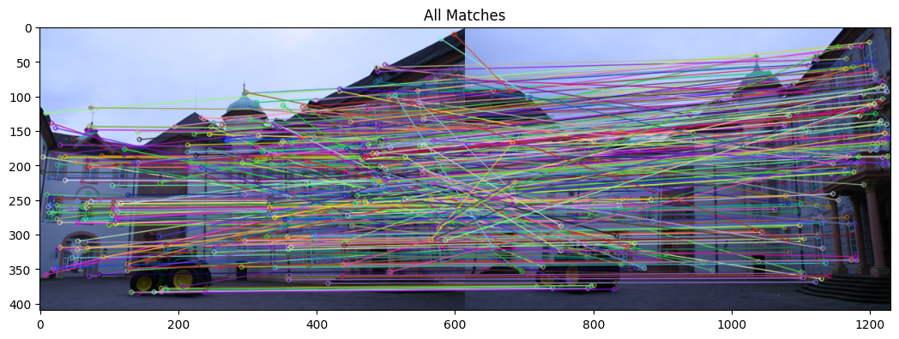

<em>Feature correspondences automatically detected between both images.</em>

  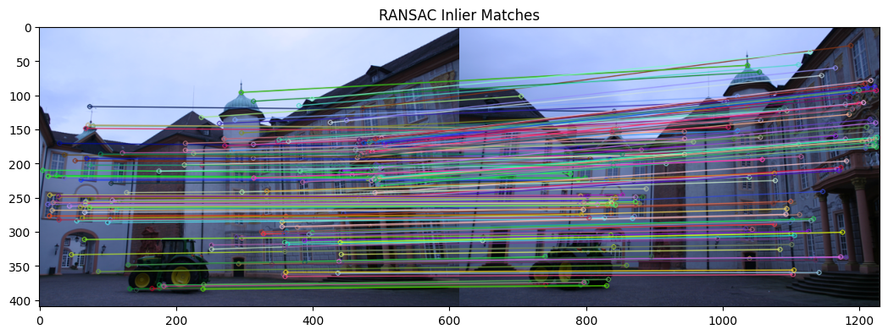

<em>RANSAC filtering removes outliers to robustly estimate the essential matrix.</em>

  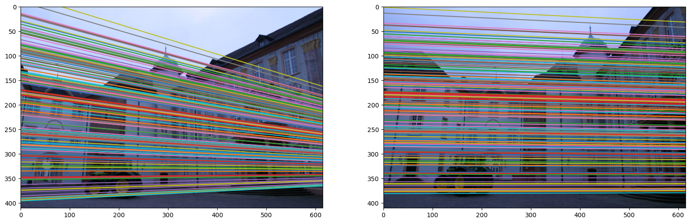

<em>Epipolar lines drawn in both images.</em>

  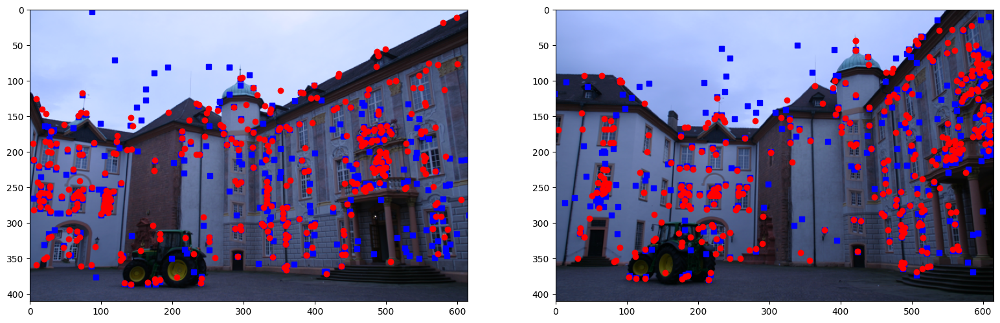

<em>Triangulated 3D points projected back into the image for reprojection validation.</em>

---

## HW 2 - Augmented Reality with AprilTags
**Goal:** Estimate camera pose from AprilTags and project virtual 3D objects into real scenes.

**Pipeline Steps:**
- Define world coordinates centered on the AprilTag.  
- Recover camera pose using **PnP** and **P3P** approaches.  
- Solve for **R** and **t** via the **Procrustes method**.  
- Map pixels to 3D world coordinates and render objects.  
- Generate an augmented-reality GIF of virtual objects on the tag plane.

**Concepts Learned:**  
Pose estimation, homography-based PnP, polynomial P3P, Procrustes alignment, camera calibration, interactive 3D projection.

  

<em>Virtual objects anchored to AprilTags using recovered camera pose.</em>

---

## HW 1 - Image Projection via Homography
**Goal:** Use homographies to project an image (the Penn logo) onto a soccer goal during a video sequence.

**Pipeline Steps:**
- Compute homography from video frame corners to logo coordinates using SVD.  
- Perform inverse warping to correctly map logo pixels into the scene.  
- Generate a video showing the logo following the moving goal with correct perspective.

**Concepts Learned:**  
Projective geometry, homography estimation, inverse warping, planar image mapping.

  

<em>Logo projection maintaining geometric consistency with the goal’s motion.</em>

---

## Topics Covered
The class develops both theoretical understanding and hands-on implementations of modern perception algorithms. Core areas include:

> *I also studied additional readings from **Hartley & Zisserman’s** “Multiple View Geometry in Computer Vision”, the **MIT Foundations of Computer Vision Textbook**, and other classic references to deepen my understanding of multi-view geometry and 3D reconstruction recommended by Prof. Kostas Daniilidis.*

**Camera Models & Calibration**
- Pinhole camera model, projection equations, and intrinsic/extrinsic parameters  
- Vanishing points, cross-ratios, and geometric transformations  
- Camera calibration from planar patterns and SVD-based pose recovery  

**Projective Geometry**
- Homographies between planes and their estimation via DLT  
- Collineations and two-view relationships  
- Coordinate transformations in homogeneous space  

**Pose Estimation & 3D Geometry**
- **PnP and P3P** for pose recovery from 2D–3D correspondences  
- **Procrustes alignment** for rigid-body transformation recovery  
- Triangulation and depth estimation from multiple calibrated views  

**Epipolar Geometry & Essential Matrix Estimation**
- Derivation of the **fundamental and essential matrices**  
- 8-point and normalized algorithms to estimate `E`   
- **RANSAC** for robust outlier rejection  
- Epipolar line visualization and reprojection validation  

**Structure from Motion (SfM) & Multi-View Reconstruction**
- Motion recovery from multiple calibrated views  
- Triangulation and dense multi-view reconstruction  
- **Bundle Adjustment (BA)** formulation and implementation  
- Differentiable reprojection, axis–angle parameterization, and gradient-based optimization in PyTorch  
- Integration of feature matching, RANSAC filtering, pose disambiguation, and BA refinement  
- Comparison with large-scale SfM frameworks such as **COLMAP**

**Optical Flow & Visual Odometry**
- Derivation and implementation of the **Lucas–Kanade** and **Horn–Schunck** methods  
- Understanding of **Ego-motion from Flow** and **Visual SLAM** concepts  
- Multi-frame motion estimation for dynamic scenes  

**Radiance Fields & Light-Field Rendering**
- Introduction to **Neural Radiance Fields (NeRF)** and radiance integration  
- Light-field rendering and plenoptic function concepts  
- Fourier and spherical harmonics in radiance representation  

**3D Perception & Modern CV Applications**
- Stereopsis and depth from disparity  
- Multi-view consistency and metric reconstruction  
- Differentiable 3D vision using PyTorch  
- Exposure to pipelines such as **COLMAP**, feature-detection methods (SIFT), and detector-free transformers (**LoFTR**)  
- Understanding the strengths and limitations of classical features vs. transformer-based correspondence models

---

### Summary
These projects build a complete foundation in geometric computer vision:
1. **HW1:** Planar projection and image warping  
2. **HW2:** 3D pose estimation and augmented reality  
3. **HW3:** Multi-view geometry and 3D reconstruction  

Each project implements a working perception pipeline that bridges theory and practical implementation in Python.
